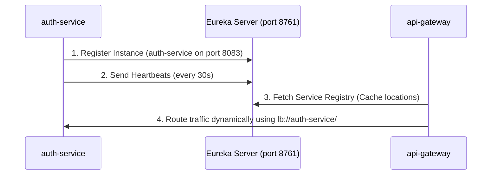

# Implementation Plan: Eureka Service Registry (Netflix Eureka Server)

This document details the configuration, deployment, and service integration steps for setting up a centralized **Eureka Service Discovery Server** for our Spring Boot microservices ecosystem.

---

## 1. Role of Eureka Server in the Architecture

A service registry is a key pattern in microservices. It allows services to find and communicate with each other dynamically without hardcoding hostname/port locations.



### Key Responsibilities:
* **Service Registration:** Maintains a registry database of active microservice instances (e.g. name, IP, port, health check URL).
* **Service Discovery:** Downstream services (like `api-gateway`) query the registry to discover and load-balance calls.
* **Heartbeat & Health Monitoring:** Evicts instances that fail to send heartbeats within a configured threshold (unless Self-Preservation triggers).

---

## 2. Tech Stack

* **Framework:** Spring Cloud Netflix Eureka Server.
* **Java Version:** 21 (inherited from the root POM).
* **Spring Cloud Version:** 2025.1.2 (inherited from the root POM).

---

## 3. Configuration: `application.yml`

In local development, the Eureka Server acts as a standalone registry. It must be configured so that it does **not** try to register with itself or fetch its own registry list.

Save this in `Eureka-server/src/main/resources/application.yml` (or `application-dev.yml` depending on active profiles):

```yaml
server:
  port: 8761

spring:
  application:
    name: eureka-server

eureka:
  instance:
    hostname: localhost
  client:
    # Disable self-registration since this is the discovery server itself
    register-with-eureka: false
    # Do not fetch registry info from other instances (standalone mode)
    fetch-registry: false
    service-url:
      defaultZone: http://${eureka.instance.hostname}:${server.port}/eureka/
  server:
    # Enable self-preservation in production, but can be disabled in dev for rapid testing
    enable-self-preservation: true
    eviction-interval-timer-in-ms: 60000
```

---

## 4. Main Application Class Setup

To run the Eureka Server, annotate the main application class with `@EnableEurekaServer`:

```java
package com.chauhan.eurekaserver;

import org.springframework.boot.SpringApplication;
import org.springframework.boot.autoconfigure.SpringBootApplication;
import org.springframework.cloud.netflix.eureka.server.EnableEurekaServer;

@SpringBootApplication
@EnableEurekaServer // Enables Netflix Eureka Server features
public class EurekaServerApplication {
    public static void main(String[] args) {
        SpringApplication.run(EurekaServerApplication.class, args);
    }
}
```

---

## 5. Integrating Other Services (Eureka Clients)

Any client microservice (e.g. `auth-service`, `gateway-service`) needs the following steps to participate:

### A. Add Dependency
Add the client starter to each client module `pom.xml`:
```xml
<dependency>
    <groupId>org.springframework.cloud</groupId>
    <artifactId>spring-cloud-starter-netflix-eureka-client</artifactId>
</dependency>
```

### B. Configure Client Properties
Add to their `application.yml`:
```yaml
eureka:
  client:
    service-url:
      defaultZone: http://localhost:8761/eureka/
    fetch-registry: true
    register-with-eureka: true
  instance:
    # Prefer IP address mapping over hostname resolution in container networks
    prefer-ip-address: true
```

---

## 6. Implementation Roadmap

### Phase 1: Main Server Configuration
1. Clean up `Eureka-server/pom.xml` (Completed).
2. Write the main Spring Boot runner with `@EnableEurekaServer`.
3. Create `src/main/resources/application.yml` config file.

### Phase 2: Client Service Integration
1. Enable Eureka Client dependencies in the `auth-service` and `gateway-service` pom files.
2. Enable client settings inside the `application.yml`/`application-dev.yml` files of both microservices.

### Phase 3: Verification
1. Start `Eureka-server` on port `8761` and access the dashboard (`http://localhost:8761`).
2. Start `auth-service` and verify it shows up under the registered instances list.
3. Start `gateway-service` and verify it connects and fetches the directory structure.
