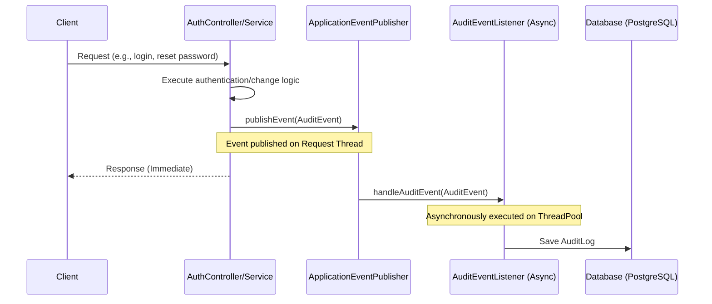

# Implementation Plan: Audit Logging and Asynchronous Spring Events

This plan details the implementation of an asynchronous audit logging system for the `auth-service` application.

## 1. Objectives
* Capture important security events: login attempts (success/failure), password changes, and account registrations.
* Use **Spring Events** to decouple the audit logging logic from the business services.
* Ensure logging is done **asynchronously** to minimize performance impact on requests.
* Record IP addresses, User Agents, event status, and user identifiers.

---

## 2. Architecture & Design



---

## 3. Detailed Component Plan

### A. Database Schema and Entity: `AuditLog`
We will create a JPA entity to store audit logs in PostgreSQL.

* **File Location:** `com.chauhan.authservice.entity.AuditLog` (mapped to [AuditLog.java](file:///run/media/sourabh/WorkSpace/Java/Spring%20boot/MicroServices/spring_core_services/auth-service/src/main/java/com/chauhan/authservice/entity/AuditLog.java))

```java
package com.chauhan.authservice.entity;

import jakarta.persistence.*;
import lombok.*;
import java.time.Instant;
import java.util.UUID;

@Entity
@Table(name = "audit_logs")
@Getter
@Setter
@NoArgsConstructor
@AllArgsConstructor
@Builder
public class AuditLog {
    @Id
    @GeneratedValue(generator = "UUID")
    @Column(unique = true, nullable = false)
    private UUID id;

    @Column(nullable = false)
    private String eventType; // e.g., LOGIN_SUCCESS, LOGIN_FAILURE, PASSWORD_CHANGE

    private String email;     // The email or username of the user who initiated the event

    private String ipAddress;

    private String userAgent;

    @Column(length = 2000)
    private String details;

    @Builder.Default
    private Instant timestamp = Instant.now();
}
```

### B. Repository: `AuditLogRepository`
* **File Location:** `com.chauhan.authservice.repository.AuditLogRepository` (mapped to [AuditLogRepository.java](file:///run/media/sourabh/WorkSpace/Java/Spring%20boot/MicroServices/spring_core_services/auth-service/src/main/java/com/chauhan/authservice/repository/AuditLogRepository.java))

```java
package com.chauhan.authservice.repository;

import com.chauhan.authservice.entity.AuditLog;
import org.springframework.data.jpa.repository.JpaRepository;
import org.springframework.stereotype.Repository;
import java.util.UUID;

@Repository
public interface AuditLogRepository extends JpaRepository<AuditLog, UUID> {
}
```

### C. Event Class: `AuditEvent`
* **File Location:** `com.chauhan.authservice.event.AuditEvent` (mapped to [AuditEvent.java](file:///run/media/sourabh/WorkSpace/Java/Spring%20boot/MicroServices/spring_core_services/auth-service/src/main/java/com/chauhan/authservice/event/AuditEvent.java))

```java
package com.chauhan.authservice.event;

import lombok.Getter;
import lombok.ToString;
import org.springframework.context.ApplicationEvent;

@Getter
@ToString
public class AuditEvent extends ApplicationEvent {
    private final String eventType;
    private final String email;
    private final String ipAddress;
    private final String userAgent;
    private final String details;

    public AuditEvent(Object source, String eventType, String email, String ipAddress, String userAgent, String details) {
        super(source);
        this.eventType = eventType;
        this.email = email;
        this.ipAddress = ipAddress;
        this.userAgent = userAgent;
        this.details = details;
    }
}
```

### D. Listener Class: `AuditEventListener`
* **File Location:** `com.chauhan.authservice.event.AuditEventListener` (mapped to [AuditEventListener.java](file:///run/media/sourabh/WorkSpace/Java/Spring%20boot/MicroServices/spring_core_services/auth-service/src/main/java/com/chauhan/authservice/event/AuditEventListener.java))
* **Note:** Annotating the handler method with `@Async` causes Spring to run it in a separate thread.

```java
package com.chauhan.authservice.event;

import com.chauhan.authservice.entity.AuditLog;
import com.chauhan.authservice.repository.AuditLogRepository;
import lombok.RequiredArgsConstructor;
import lombok.extern.slf4j.Slf4j;
import org.springframework.context.event.EventListener;
import org.springframework.scheduling.annotation.Async;
import org.springframework.stereotype.Component;

@Component
@RequiredArgsConstructor
@Slf4j
public class AuditEventListener {

    private final AuditLogRepository auditLogRepository;

    @Async
    @EventListener
    public void handleAuditEvent(AuditEvent event) {
        log.info("Processing audit event asynchronously: {}", event);
        AuditLog auditLog = AuditLog.builder()
                .eventType(event.getEventType())
                .email(event.getEmail())
                .ipAddress(event.getIpAddress())
                .userAgent(event.getUserAgent())
                .details(event.getDetails())
                .build();
        auditLogRepository.save(auditLog);
    }
}
```

### E. Configuration: Asynchronous Executor Configuration
To avoid default unchecked simple thread executors (which spawn new threads for every task), we will define a custom executor configuration.

* **File Location:** `com.chauhan.authservice.config.AsyncConfig` (mapped to [AsyncConfig.java](file:///run/media/sourabh/WorkSpace/Java/Spring%20boot/MicroServices/spring_core_services/auth-service/src/main/java/com/chauhan/authservice/config/AsyncConfig.java))

```java
package com.chauhan.authservice.config;

import org.springframework.context.annotation.Bean;
import org.springframework.context.annotation.Configuration;
import org.springframework.scheduling.annotation.EnableAsync;
import org.springframework.scheduling.concurrent.ThreadPoolTaskExecutor;
import java.util.concurrent.Executor;

@Configuration
@EnableAsync
public class AsyncConfig {

    @Bean(name = "taskExecutor")
    public Executor taskExecutor() {
        ThreadPoolTaskExecutor executor = new ThreadPoolTaskExecutor();
        executor.setCorePoolSize(5);
        executor.setMaxPoolSize(10);
        executor.setQueueCapacity(500);
        executor.setThreadNamePrefix("AsyncAudit-");
        executor.initialize();
        return executor;
    }
}
```

---

## 4. Integration Points

### I. Login Success & Failure (Local)
* **Target File:** `com/chauhan/authservice/service/impl/AuthServiceImpl.java` ([AuthServiceImpl.java](file:///run/media/sourabh/WorkSpace/Java/Spring%20boot/MicroServices/spring_core_services/auth-service/src/main/java/com/chauhan/authservice/service/impl/AuthServiceImpl.java))
* **Modifications:**
  * Inject `ApplicationEventPublisher`.
  * In `login()`:
    * Try-block: On authentication success: publish event with type `LOGIN_SUCCESS`.
    * Catch `AuthenticationException`: Publish event with type `LOGIN_FAILURE` containing email and failure details, then throw exception.
    * Check verification: If email is not verified, publish event with type `LOGIN_FAILURE`, then throw `EmailNotVerifiedException`.

### II. Login Success (Social / OAuth2)
* **Target File:** `com/chauhan/authservice/security/OAuth2SuccessHandler.java` ([OAuth2SuccessHandler.java](file:///run/media/sourabh/WorkSpace/Java/Spring%20boot/MicroServices/spring_core_services/auth-service/src/main/java/com/chauhan/authservice/security/OAuth2SuccessHandler.java))
* **Modifications:**
  * Inject `ApplicationEventPublisher`.
  * Publish `LOGIN_SUCCESS` with detail indicating social provider (e.g. Google, GitHub) and user's email.

### III. Login Failure (Social / OAuth2)
* **Target File:** `com/chauhan/authservice/security/OAuth2FailureHandler.java` ([OAuth2FailureHandler.java](file:///run/media/sourabh/WorkSpace/Java/Spring%20boot/MicroServices/spring_core_services/auth-service/src/main/java/com/chauhan/authservice/security/OAuth2FailureHandler.java))
* **Modifications:**
  * Inject `ApplicationEventPublisher`.
  * Publish `LOGIN_FAILURE` indicating OAuth2 failure.

### IV. Password Reset (Token Flow)
* **Target File:** `com/chauhan/authservice/service/impl/AuthServiceImpl.java` ([AuthServiceImpl.java](file:///run/media/sourabh/WorkSpace/Java/Spring%20boot/MicroServices/spring_core_services/auth-service/src/main/java/com/chauhan/authservice/service/impl/AuthServiceImpl.java))
* **Modifications:**
  * In `resetPassword()`: Publish `PASSWORD_CHANGE` event. Extract HTTP details using `RequestContextHolder` if available, or populate with defaults.

### V. Password Change (User Update Profile)
* **Target File:** `com/chauhan/authservice/service/impl/UserServiceImpl.java` ([UserServiceImpl.java](file:///run/media/sourabh/WorkSpace/Java/Spring%20boot/MicroServices/spring_core_services/auth-service/src/main/java/com/chauhan/authservice/service/impl/UserServiceImpl.java))
* **Modifications:**
  * In `updateUser()`: If password field is present and non-empty, publish `PASSWORD_CHANGE` event.

---

## 5. Verification Plan
* Compile and build the project using Maven to check for compilation/lint errors.
* We can create verification JUnit tests inside `src/test` to assert that events are correctly published and stored in the database.
