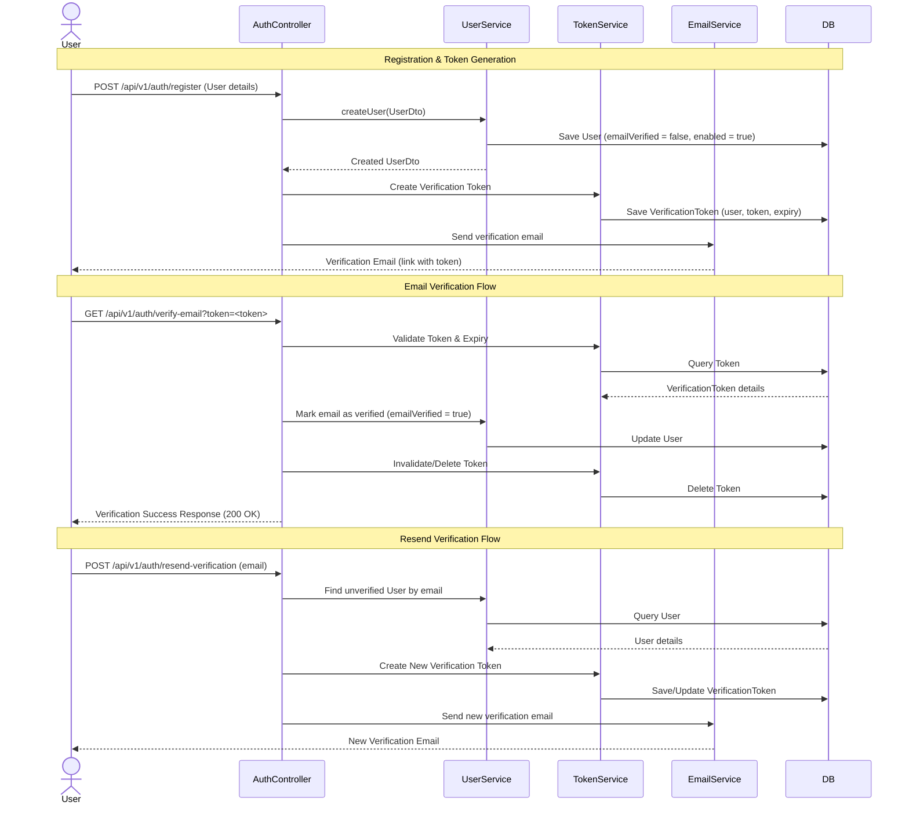

# Design Plan: Email Verification Flow

This design document outlines the implementation plan for the **Email Verification** flow in the `auth-service`, which must be completed before Password Reset.

---

## 1. Flow Overview



---

## 2. Dependencies

We will add the `spring-boot-starter-mail` dependency to `pom.xml` to support sending emails.

```xml
<dependency>
    <groupId>org.springframework.boot</groupId>
    <artifactId>spring-boot-starter-mail</artifactId>
</dependency>
```

---

## 3. Entity & Database Changes

### User Entity Updates
We will add an `emailVerified` column to the `User` entity to distinguish between verification status and administrative suspension (`enable`):
* `private boolean emailVerified = false;` (Defaults to `false` for local registrations, but we can set it to `true` for OAuth2/social logins later).

```java
// In User.java
@Builder.Default
private boolean emailVerified = false;
```

### `VerificationToken` Entity
A separate table to manage email verification tokens.
* **Attributes:**
  * `id`: `UUID` (Primary Key)
  * `token`: `String` (Unique verification token)
  * `user`: `User` (One-to-one mapping with `User`)
  * `expiryDate`: `Instant` (Expiry timestamp, e.g. 24 hours after generation)

```java
@Entity
@Table(name = "verification_tokens")
@Getter
@Setter
@NoArgsConstructor
@AllArgsConstructor
@Builder
public class VerificationToken {
    @Id
    @GeneratedValue(generator = "UUID")
    @Column(unique = true, nullable = false)
    private UUID id;

    @Column(nullable = false, unique = true)
    private String token;

    @OneToOne(fetch = FetchType.LAZY)
    @JoinColumn(name = "user_id", nullable = false)
    private User user;

    @Column(nullable = false)
    private Instant expiryDate;
}
```

---

## 4. Preventing Login for Unverified Users

We must enforce that users who haven't verified their email cannot log in.
1. During authentication inside [AuthController.login](file:///run/media/sourabh/WorkSpace/Java/Spring%20boot/MicroServices/spring_core_services/auth-service/src/main/java/com/chauhan/authservice/controller/AuthController.java):
   After successful credentials validation, check if `user.isEmailVerified()` is `false`.
2. If `false`, throw a custom exception `EmailNotVerifiedException`.
3. Map `EmailNotVerifiedException` in `GlobalExceptionHandler` to return `403 Forbidden` or `401 Unauthorized` with a clear message: `"Email is not verified. Please check your inbox or resend verification link."`

---

## 5. DTOs & Request Formats

### `ResendVerificationRequest`
```java
public record ResendVerificationRequest(
    @NotBlank(message = "Email is required")
    @Email(message = "Invalid email format")
    String email
) {}
```

---

## 6. Service Layer

### Email Service
* `EmailService` and `EmailServiceImpl` (using `JavaMailSender` and standard console logs in development).

### Verification Token Service
* `VerificationTokenService` and `VerificationTokenServiceImpl`
* **Responsibilities:**
  * Generate a token for a registered user.
  * Retrieve and validate a token (existence and expiration check).
  * Delete/invalidate the token.

---

## 7. REST Controller Endpoints

In `AuthController`:

1. **`GET /api/v1/auth/verify-email?token=<token>`**
   * **Behavior**:
     * Retrieve the verification token.
     * Validate token exists and has not expired.
     * Set `user.emailVerified = true` in the DB.
     * Delete the verification token.
     * Return a success message or HTML confirmation page.
   * **Access**: Public.

2. **`POST /api/v1/auth/resend-verification`**
   * **Request Body**: `ResendVerificationRequest`
   * **Behavior**:
     * Look up the user by email.
     * If the user doesn't exist, return 200 OK (standard security practice to avoid email enumeration).
     * If the user is already verified, return a message indicating the email is already verified.
     * If the user is unverified, delete any existing verification token for this user, generate a new token, save it, and send a new email.
     * Return success message: `"Verification email sent successfully."`
   * **Access**: Public.
