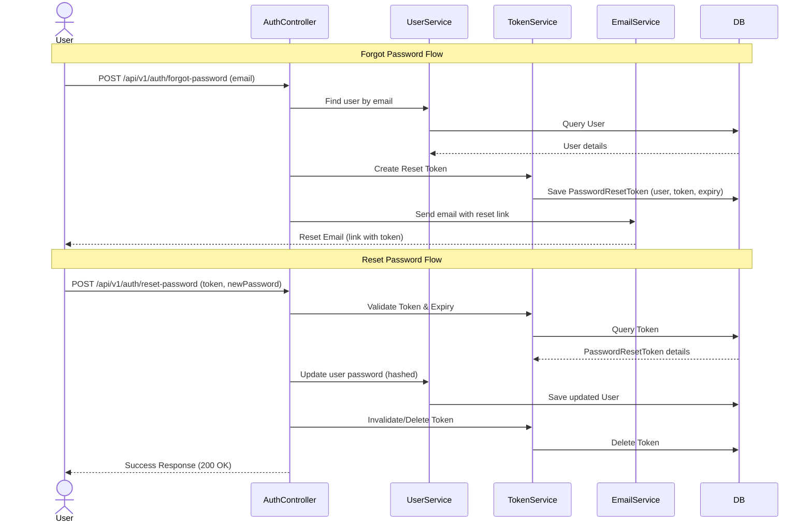

# Design Plan: Password Reset Flow

This design document outlines the implementation plan for the **Forgot Password** and **Password Reset** flows in the `auth-service`.

---

## 1. Flow Overview



---

## 2. Dependencies

We will add the `spring-boot-starter-mail` dependency to `pom.xml` to support sending emails.

```xml
<dependency>
    <groupId>org.springframework.boot</groupId>
    <artifactId>spring-boot-starter-mail</artifactId>
</dependency>
```

---

## 3. Database & Entity Design

### `PasswordResetToken` Entity
We will create a new entity class `PasswordResetToken` representing the token associated with a user for password resets.

* **Attributes:**
  * `id`: `UUID` (Primary Key)
  * `token`: `String` (Unique, indexable token)
  * `user`: `User` (One-to-one mapping with the `User` entity)
  * `expiryDate`: `Instant` (Timestamp after which the token is invalid; default lifetime of 15 minutes)

```java
@Entity
@Table(name = "password_reset_tokens")
@Getter
@Setter
@NoArgsConstructor
@AllArgsConstructor
@Builder
public class PasswordResetToken {
    @Id
    @GeneratedValue(generator = "UUID")
    @Column(unique = true, nullable = false)
    private UUID id;

    @Column(nullable = false, unique = true)
    private String token;

    @OneToOne(fetch = FetchType.LAZY)
    @JoinColumn(name = "user_id", nullable = false)
    private User user;

    @Column(nullable = false)
    private Instant expiryDate;
}
```

---

## 4. DTOs

### `ForgotPasswordRequest`
Used in the request payload of the forgot password endpoint.
```java
public record ForgotPasswordRequest(
    @NotBlank(message = "Email is required")
    @Email(message = "Invalid email format")
    String email
) {}
```

### `ResetPasswordRequest`
Used in the request payload of the reset password endpoint.
```java
public record ResetPasswordRequest(
    @NotBlank(message = "Token is required")
    String token,

    @NotBlank(message = "New password is required")
    @Size(min = 8, message = "Password must be at least 8 characters long")
    String newPassword
) {}
```

---

## 5. Service Layer

### Email Service
* **Interface**: `EmailService`
* **Implementation**: `EmailServiceImpl` (using `JavaMailSender`)
* **Responsibility**: Sends emails with HTML formatting or plain text.

### Password Reset Token Service
* **Interface**: `PasswordResetTokenService`
* **Implementation**: `PasswordResetTokenServiceImpl`
* **Responsibilities**:
  * Create a secure random token for a user.
  * Retrieve and validate a token (checking if it exists and is not expired).
  * Delete/invalidate the token after successful usage.

### UserService Updates
* Add a method to update the user's password using the hashed new password:
  ```java
  void updatePassword(User user, String newPassword);
  ```

---

## 6. REST Controller Endpoints

In [AuthController](file:///run/media/sourabh/WorkSpace/Java/Spring%20boot/MicroServices/spring_core_services/auth-service/src/main/java/com/chauhan/authservice/controller/AuthController.java):

1. **`POST /api/v1/auth/forgot-password`**
   * **Request Body**: `ForgotPasswordRequest`
   * **Behavior**:
     * Look up the user by email. If the user doesn't exist, return 200 OK anyway to prevent **email enumeration** attacks (but don't send an email).
     * If the user exists, create a `PasswordResetToken`.
     * Build the reset URL (e.g. `http://localhost:3000/reset-password?token=<token>`).
     * Call the `EmailService` to send the link to the user.
     * Return a generic success message (e.g. "If the email is registered, you will receive a password reset link").
   * **Access**: Public.

2. **`POST /api/v1/auth/reset-password`**
   * **Request Body**: `ResetPasswordRequest`
   * **Behavior**:
     * Fetch the `PasswordResetToken` by the provided token string.
     * If not found or expired (compare `expiryDate` with current time), throw a validation exception/bad request.
     * Hash the `newPassword` and update the user's password.
     * Save the user.
     * Delete the `PasswordResetToken` so it cannot be reused.
     * Return success message.
   * **Access**: Public.

---

## 7. Mail & Token Expiry Configuration

In `application-dev.yml`, configure default SMTP properties. For local development, we can configure properties targeting standard local mail servers (e.g., Maildev/MailHog) or standard mock properties:

```yaml
spring:
  mail:
    host: localhost
    port: 1025 # Maildev / Mailhog SMTP default port
    properties:
      mail:
        smtp:
          auth: false
          starttls:
            enable: false
```

And define configuration properties for token lifetime (defaulting to 900 seconds / 15 minutes):

```yaml
security:
  password-reset:
    token-ttl-seconds: 900
    reset-url: http://localhost:8082/api/v1/auth/reset-password # or frontend reset page
```

---

## 8. Verification of Security Mapping

* Public URLs in `AppConstants.java` include `/api/v1/auth/**`, so any new endpoints under `/api/v1/auth/` will automatically be public and bypass JWT filter checks. This matches the requirements.
