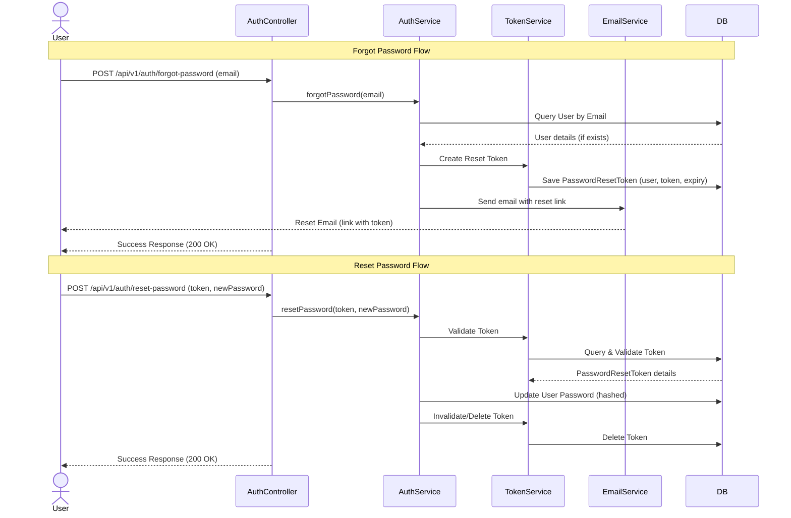

# Design Plan: Password Reset Flow (Clean Controller Edition)

This design document outlines the implementation plan for the **Forgot Password** and **Password Reset** flows in the `auth-service`, utilizing our clean decoupled architecture.

---

## 1. Flow Overview



---

## 2. Entity Design

### `PasswordResetToken` Entity
A new entity class `PasswordResetToken` representing the token associated with a user for password resets.

* **Attributes:**
  * `id`: `UUID` (Primary Key)
  * `token`: `String` (Unique, indexable token)
  * `user`: `User` (One-to-one mapping with the `User` entity)
  * `expiryDate`: `Instant` (Timestamp after which the token is invalid; default lifetime of 15 minutes)

```java
package com.chauhan.authservice.entity;

import jakarta.persistence.*;
import lombok.*;
import java.time.Instant;
import java.util.UUID;

@Entity
@Table(name = "password_reset_tokens")
@Getter
@Setter
@NoArgsConstructor
@AllArgsConstructor
@Builder
public class PasswordResetToken {
    @Id
    @GeneratedValue(generator = "UUID")
    @Column(unique = true, nullable = false)
    private UUID id;

    @Column(nullable = false, unique = true)
    private String token;

    @OneToOne(fetch = FetchType.LAZY)
    @JoinColumn(name = "user_id", nullable = false)
    private User user;

    @Column(nullable = false)
    private Instant expiryDate;
}
```

---

## 3. Repositories

### `PasswordResetTokenRepository`
```java
package com.chauhan.authservice.repository;

import com.chauhan.authservice.entity.PasswordResetToken;
import com.chauhan.authservice.entity.User;
import org.springframework.data.jpa.repository.JpaRepository;
import java.util.Optional;
import java.util.UUID;

public interface PasswordResetTokenRepository extends JpaRepository<PasswordResetToken, UUID> {
    Optional<PasswordResetToken> findByToken(String token);
    Optional<PasswordResetToken> findByUser(User user);
    void deleteByUser(User user);
}
```

---

## 4. DTOs

### `ForgotPasswordRequest`
```java
package com.chauhan.authservice.dto.request;

import jakarta.validation.constraints.Email;
import jakarta.validation.constraints.NotBlank;

public record ForgotPasswordRequest(
    @NotBlank(message = "Email is required !!")
    @Email(message = "Invalid Email !!")
    String email
) {}
```

### `ResetPasswordRequest`
```java
package com.chauhan.authservice.dto.request;

import jakarta.validation.constraints.NotBlank;
import jakarta.validation.constraints.Size;

public record ResetPasswordRequest(
    @NotBlank(message = "Token is required !!")
    String token,

    @NotBlank(message = "New password is required !!")
    @Size(min = 8, message = "Password must be at least 8 characters long !!")
    String newPassword
) {}
```

---

## 5. Service Layer Updates

### 1. `EmailService` interface update:
Add method signature:
```java
void sendPasswordResetEmail(String to, String token);
```

And in `EmailServiceImpl`, implement SMTP sending to MailHog.

### 2. New `PasswordResetTokenService` interface:
```java
package com.chauhan.authservice.service;

import com.chauhan.authservice.entity.PasswordResetToken;
import com.chauhan.authservice.entity.User;

public interface PasswordResetTokenService {
    PasswordResetToken createTokenForUser(User user);
    PasswordResetToken validateToken(String tokenString);
    void deleteToken(PasswordResetToken token);
    void deleteTokenByUser(User user);
}
```

Implement it as `PasswordResetTokenServiceImpl` calling `passwordResetTokenRepository.flush()` during deletes to avoid constraint conflicts.

### 3. `AuthService` updates:
Expose:
```java
void forgotPassword(String email);
void resetPassword(String token, String newPassword);
```

Implement in `AuthServiceImpl`:
- `forgotPassword(email)`:
  - Find user by email. If not found, return immediately (security practice).
  - Create reset token, and send reset email.
- `resetPassword(token, newPassword)`:
  - Validate reset token.
  - Hashing the new password.
  - Update user password.
  - Delete reset token.

---

## 6. Controller Endpoints

Add to `AuthController`:

1. **`POST /api/v1/auth/forgot-password`**
   * **Request Body**: `ForgotPasswordRequest`
   * **Access**: Public.
   * **Behavior**:
     ```java
     @PostMapping("/forgot-password")
     public ResponseEntity<Map<String, String>> forgotPassword(@Valid @RequestBody ForgotPasswordRequest request) {
         authService.forgotPassword(request.email());
         return ResponseEntity.ok(Map.of("message", "If the email is registered, a password reset link has been sent."));
     }
     ```

2. **`POST /api/v1/auth/reset-password`**
   * **Request Body**: `ResetPasswordRequest`
   * **Access**: Public.
   * **Behavior**:
     ```java
     @PostMapping("/reset-password")
     public ResponseEntity<Map<String, String>> resetPassword(@Valid @RequestBody ResetPasswordRequest request) {
         authService.resetPassword(request.token(), request.newPassword());
         return ResponseEntity.ok(Map.of("message", "Password reset successfully. You can now log in."));
     }
     ```

---

## 7. Development Configurations

In `application-dev.yml`, under `security`:
```yaml
  password-reset:
    token-ttl-seconds: ${PASSWORD_RESET_TOKEN_TTL_SECONDS:900} # 15 minutes
```
