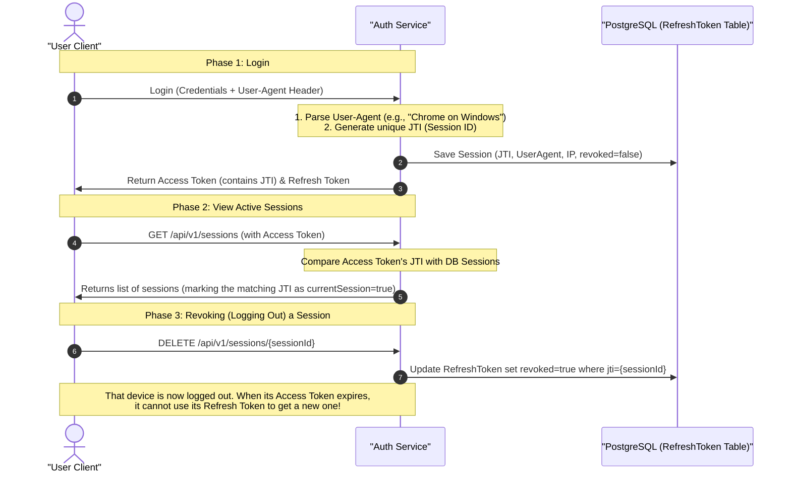

# Implementation Plan: Session Management (View & Revoke Sessions)

This plan details the steps required to implement Session Management in the `auth-service`, allowing users to view their active sessions (devices, browsers, IP addresses) and revoke them remotely.

---

## 0. Concept: What is a "Session" in Stateless JWT?

In a stateless JWT architecture, the server does not store access tokens. However, to maintain session state across access token expirations, we use a database-backed **Refresh Token**. 

Every time a user logs in (from a phone, laptop, or different browser), a new [RefreshToken.java](file:///run/media/sourabh/WorkSpace/Java/Spring%20boot/MicroServices/spring_core_services/auth-service/src/main/java/com/chauhan/authservice/entity/RefreshToken.java) entry is generated in the PostgreSQL database with a unique `jti` (JWT ID).

Therefore, **each unexpired, non-revoked Refresh Token in the database represents an active user session.**

### The Auditing Challenge: Identifying the System/Device
A database ID or JTI (e.g. `f11b491e-18ec-4513...`) is meaningless to a human user. To make security audits useful, we must store and display client metadata:
1. **IP Address:** Indicates the geographical/network source of the login.
2. **User-Agent String:** Parsed to extract the **Browser** (Chrome, Safari, Firefox) and **Operating System** (Windows, macOS, Android, iOS) to produce a friendly device info string (e.g., "Chrome on Windows 10").
3. **Current Session Flag:** Identifies which session in the list belongs to the device the user is currently calling from.

---

## 1. Database Entity Enhancements

We will add metadata fields to the `RefreshToken` entity to store client information.

* **File to modify:** [RefreshToken.java](file:///run/media/sourabh/WorkSpace/Java/Spring%20boot/MicroServices/spring_core_services/auth-service/src/main/java/com/chauhan/authservice/entity/RefreshToken.java)
* **Fields to add:**
  ```java
  @Column(name = "ip_address", length = 45)
  private String ipAddress;

  @Column(name = "user_agent", length = 500)
  private String userAgent;

  @Column(name = "device_info", length = 150)
  private String deviceInfo; // e.g. "Chrome on Windows"
  ```

---

## 2. Dependency: User-Agent Parser

To parse the complex, raw `User-Agent` HTTP header into a clean, human-readable browser and OS string, we will add a lightweight parser dependency.

* **File to modify:** [pom.xml](file:///run/media/sourabh/WorkSpace/Java/Spring%20boot/MicroServices/spring_core_services/auth-service/pom.xml)
* **Dependency to add:**
  ```xml
  <dependency>
      <groupId>com.github.ua-parser</groupId>
      <artifactId>uap-java</artifactId>
      <version>1.6.1</version>
  </dependency>
  ```

---

## 3. DTO Design

We will create a `SessionResponse` DTO to expose session details back to the client.

* **New File to create:** `com.chauhan.authservice.dto.response.SessionResponse`
* **Content:**
  ```java
  package com.chauhan.authservice.dto.response;

  import lombok.Builder;
  import lombok.Data;
  import java.time.Instant;
  import java.util.UUID;

  @Data
  @Builder
  public class SessionResponse {
      private UUID sessionId;
      private String ipAddress;
      private String deviceInfo;
      private Instant createdAt;
      private Instant expiresAt;
      private boolean currentSession;
  }
  ```

---

## 4. Capturing Metadata at Login

We will update our login and refresh logic to accept and capture `ipAddress` and `userAgent` from the HTTP request headers.

### A. Update `RefreshTokenService`
* **File to modify:** [RefreshTokenService.java](file:///run/media/sourabh/WorkSpace/Java/Spring%20boot/MicroServices/spring_core_services/auth-service/src/main/java/com/chauhan/authservice/service/impl/RefreshTokenService.java)
* **Method signature update:**
  ```java
  @Transactional
  public RefreshToken createRefreshToken(User user, String ipAddress, String userAgent) {
      String deviceInfo = parseDeviceInfo(userAgent);
      
      RefreshToken refreshToken = RefreshToken.builder()
              .jti(UUID.randomUUID().toString())
              .user(user)
              .createdAt(Instant.now())
              .expiresAt(Instant.now().plusSeconds(jwtUtil.getRefreshTtlSeconds()))
              .revoked(false)
              .ipAddress(ipAddress)
              .userAgent(userAgent)
              .deviceInfo(deviceInfo)
              .build();
      return refreshTokenRepository.save(refreshToken);
  }

  private String parseDeviceInfo(String userAgentString) {
      if (userAgentString == null || userAgentString.isBlank()) {
          return "Unknown Device";
      }
      try {
          ua_parser.Parser uaParser = new ua_parser.Parser();
          ua_parser.Client c = uaParser.parse(userAgentString);
          return String.format("%s on %s", c.userAgent.family, c.os.family);
      } catch (Exception e) {
          return "Unknown Browser/OS";
      }
  }
  ```

### B. Update Controllers and Success Handlers
Capture metadata headers from request contexts:
1. **Local Login:** In [AuthController.java](file:///run/media/sourabh/WorkSpace/Java/Spring%20boot/MicroServices/spring_core_services/auth-service/src/main/java/com/chauhan/authservice/controller/AuthController.java), extract headers:
   * `String userAgent = request.getHeader("User-Agent");`
   * `String ipAddress = request.getRemoteAddr();` (resolving proxy/load balancer `X-Forwarded-For` header if present).
2. **OAuth2 Login Success Handler:** In [OAuth2SuccessHandler.java](file:///run/media/sourabh/WorkSpace/Java/Spring%20boot/MicroServices/spring_core_services/auth-service/src/main/java/com/chauhan/authservice/security/OAuth2SuccessHandler.java), extract user-agent and IP from the success servlet parameters and pass them to `refreshTokenService.createRefreshToken()`.

---

## 5. Exposing Session Management Endpoints

We will create a controller to allow authenticated users to interact with their active sessions.

* **New File to create:** `com.chauhan.authservice.controller.SessionController`
* **Endpoints:**
  * `GET /api/v1/sessions`: Lists active sessions. It resolves the current session `jti` from the authorization header to set `currentSession = true` on the matching session DTO.
  * `DELETE /api/v1/sessions/{sessionId}`: Terminates a specific session by setting `revoked = true` in the DB.
  * `DELETE /api/v1/sessions/other`: Revokes all active refresh tokens for the user *except* the one associated with the active request.

---

## 6. Verification & Testing

* **Integration Tests:** Add test cases in `SessionIntegrationTests.java`:
  * Mock `User-Agent` headers (e.g., `Mozilla/5.0 (iPhone; CPU iPhone OS...)`) and confirm the DB stores parsed string `"Mobile Safari on iOS"`.
  * Verify `/api/v1/sessions` correctly maps `currentSession` Boolean based on active JWT.
  * Validate that revoking a session instantly rejects subsequent refresh token requests with a 401 Unauthorized status.

---

## 7. Simplified Explanation (In Plain English)

If you're finding the session management code a bit hard to digest, here is a simple analogy and breakdown of how it works.

### 🎭 The Concert Wristband & ID Analogy

Imagine entering a multi-day music festival:
1. **Access Token (The Wristband - Stateless)**
   - When you check in, you are given a **Wristband**.
   - Security guards at the different stages only check if the wristband has the official festival stamp and is not expired. They **do not** call the box office to verify who you are every time you walk past. 
   - This is fast and efficient (Stateless). But the downside is: if someone steals your wristband, they can get in until the wristband expires.

2. **Refresh Token (The Registration Receipt - State-based Session)**
   - To make sure you don't have to go home if your wristband expires after 15 minutes, the box office also gives you a **Receipt** linked to your ID, which is filed in their ledger (the database).
   - This receipt lists your name, your phone model (User-Agent/Device Info), and your ticket number (`jti`).
   - When your wristband expires, you present this receipt to the box office to get a fresh wristband.

3. **Session Management (Managing the Ledger)**
   - **View Sessions:** You can ask the box office, *"Show me all active receipts registered under my name."* They look at the ledger and say: *"You have one receipt for an iPhone, and one for a Windows laptop."*
   - **Identify Current Session:** The box office checks your current device and tells you, *"You are currently talking to me from the Windows laptop."*
   - **Revoke/Log Out of a Session:** If you lost your iPhone, you can tell the box office, *"Cross the iPhone receipt off the ledger (set `revoked = true`)."* The next time someone tries to present that iPhone receipt to get a new wristband, the box office will refuse it and throw it away, effectively logging them out.

---

### 🔄 The Step-by-Step Flow in the Code

Here is exactly what happens behind the scenes:



### 💡 Key Takeaways of this Implementation:
* **A "Session" is a row in the database:** In stateless JWT, we don't have traditional sessions. Instead, **each Refresh Token row** in our database represents an active session (a device logged in).
* **`jti` is the Connector:** The Access Token has a `jti` claim that matches the database Refresh Token's `jti`. This is how the server knows *which* device in the list is the one making the current request (`currentSession = true`).
* **Instant Revocation:** Revoking a session is as simple as marking `revoked = true` in the DB. The access token might still work for its remaining short lifetime (e.g. 5 minutes), but once it expires, the user can never get a new one.
