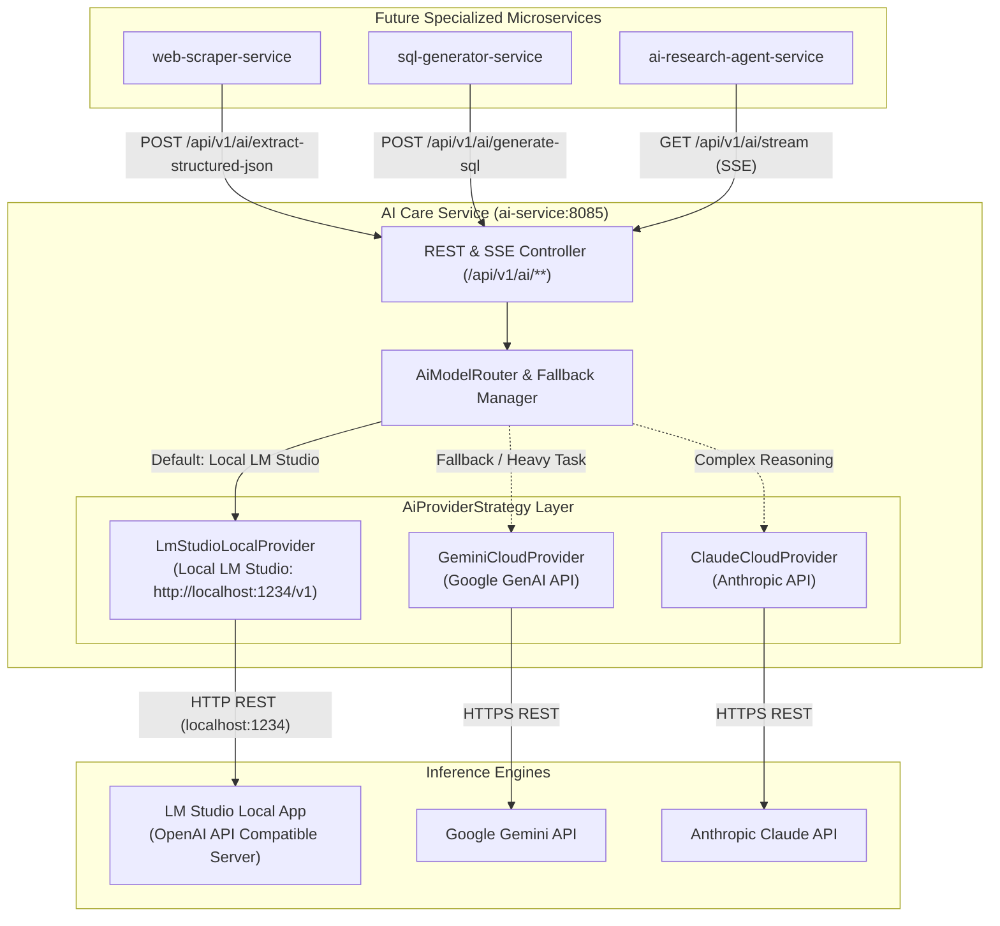

# Architectural Design & Implementation Plan: AI Care & Delegation Service (`ai-service`)

This document details the architectural vision, provider-agnostic LLM/SLM design, LM Studio integration, pragmatic microservice evaluation, and **future specialized AI consumers (Web Scraper, Dynamic SQL Generator, AI Research Agent)**.

---

## Executive Summary & Architectural Reality Check

### "Do current microservices really need AI integration right now?"
**Short Answer: No.** 

Forcing AI into core infrastructure microservices (`auth-service`, `gateway-service`, `notification-service`) right now is **over-engineering** and adds unnecessary complexity, latency, and non-deterministic behavior to production critical paths.

#### Service-by-Service Justification Matrix

| Microservice | Primary Function | Should It Use AI Right Now? | Architectural Rationale |
| :--- | :--- | :--- | :--- |
| **`Eureka-server`** | Service Registry | ❌ **No** | Pure service lookup directory. Zero AI requirement. |
| **`gateway-service`** | Routing, Rate Limiting, JWT Verification | ❌ **No** | Must execute in **< 1ms**. Calling an LLM/SLM in gateway filters adds hundreds of milliseconds of latency and degrades traffic throughput. Standard Spring Cloud Gateway filters are bulletproof. |
| **`auth-service`** | Login, Registration, JWT Issuance, Session Management | ❌ **No** | Security operations must be **100% deterministic**, predictable, and instant. Standard Spring Security, BCrypt, and database sessions are faster and immune to LLM hallucinations or model timeouts. |
| **`notification-service`** | Welcome Emails, Password Reset Emails, SMS, Push | ❌ **No** | HTML email templates with dynamic placeholder substitution (via Thymeleaf) are fast, reliable, and cost zero computation. AI dynamic rewriting runs the risk of altering critical links, tokens, or security warnings. |

---

## Section 0: Future Specialized AI Services & Integration Blueprint

When you build specialized AI-driven microservices in the future, **`ai-service`** acts as a centralized **AI Infrastructure Engine**. These specialized services delegate heavy prompting, LLM reasoning, fallback routing, and token management to `ai-service`:

```text
┌─────────────────────────┐   ┌─────────────────────────┐   ┌─────────────────────────┐
│   web-scraper-service   │   │  sql-generator-service  │   │ research-agent-service  │
│  (Fetches Raw HTML/DOM) │   │ (Natural Lang to SQL)   │   │  (Multi-Step ReAct Loop)│
└────────────┬────────────┘   └────────────┬────────────┘   └────────────┬────────────┘
             │                             │                             │
             │ JSON Extraction             │ Schema Prompting            │ Real-Time SSE Stream
             └──────────────────────┐      │      ┌──────────────────────┘
                                    ▼      ▼      ▼
                        ┌───────────────────────────────────┐
                        │            ai-service             │
                        │    (Port 8085 - Eureka Registered)│
                        └─────────────────┬─────────────────┘
                                          │
                                          ▼
                        ┌───────────────────────────────────┐
                        │      LM Studio (http://localhost) │
                        │      Google Gemini / Anthropic    │
                        └───────────────────────────────────┘
```

### 1. Web Scraper Service (`web-scraper-service`)
* **Role:** Fetches raw web content via Playwright / Jsoup / Selenium.
* **Delegation to `ai-service`:** Sends messy, unstructured HTML text to `ai-service` (`POST /api/v1/ai/extract-structured-json`).
* **Result:** `ai-service` uses local LM Studio or Gemini to extract clean, typed JSON objects (e.g. product catalogs, prices, article metadata) adhering to a strict JSON Schema.

### 2. Dynamic SQL / Query Generator (`sql-generator-service`)
* **Role:** Converts natural language user prompts into database queries (Text-to-SQL).
* **Delegation to `ai-service`:** Passes the target database schema (tables, columns, foreign keys) along with the user's natural language request to `ai-service` (`POST /api/v1/ai/generate-sql`).
* **Result:** `ai-service` prompts the LLM to output sanitized, parameter-bound SQL queries with natural language explanations.

### 3. AI Research Agent (`ai-research-agent-service`)
* **Role:** Executes multi-step autonomous research loops (ReAct pattern: Reason -> Act -> Observe).
* **Delegation to `ai-service`:** Uses WebFlux Server-Sent Events (SSE) streaming (`GET /api/v1/ai/stream`) to execute intermediate reasoning steps, synthesize multi-source data, and stream real-time thought chains to the web UI.

---

## Section 1: Local Model Integration (LM Studio Support)

### LM Studio Configuration

**LM Studio** runs locally and exposes an **OpenAI-Compatible REST API** (at `http://localhost:1234/v1`).

`ai-service` connects directly to LM Studio using **Spring AI's OpenAI Starter**:

```text
┌─────────────────────────┐           HTTP OpenAI Protocol          ┌─────────────────────────┐
│       ai-service        │────────────────────────────────────────►│        LM Studio        │
│ (Spring AI OpenAI Star) │   Base URL: http://localhost:1234/v1    │  (Local SLM/LLM Engine) │
└─────────────────────────┘                                         └─────────────────────────┘
```

#### Application Property Setup for LM Studio (`application-dev.yml`)

```yaml
server:
  port: 8085

spring:
  application:
    name: ai-service

  # Spring AI Configuration for Local LM Studio (OpenAI Compatible API)
  ai:
    openai:
      base-url: http://localhost:1234/v1
      api-key: lm-studio # LM Studio accepts any non-null string key
      chat:
        options:
          model: local-model # LM Studio routes requests to currently loaded model
          temperature: 0.7

    # Optional Cloud Provider Fallback (Configured via Environment Variables)
    google:
      genai:
        api-key: ${GEMINI_API_KEY:dummy_key}
        chat:
          options:
            model: gemini-1.5-flash

    anthropic:
      api-key: ${CLAUDE_API_KEY:dummy_key}
      chat:
        options:
          model: claude-3-5-sonnet-20241022
```

---

## Section 2: Provider-Agnostic Abstraction Architecture

To support switching between **LM Studio (Local)** and **Cloud LLMs (Gemini, Claude, OpenAI)** without changing microservice consumption code, `ai-service` uses the **Strategy & Router Pattern**:

```text
               ┌──────────────────────────────────────────┐
               │         Specialized Microservices        │
               │  (Web Scraper, SQL Gen, Research Agent)  │
               └────────────────────┬─────────────────────┘
                                    │
                                    ▼
               ┌──────────────────────────────────────────┐
               │        AiModelRouter & Controller        │
               └────────────────────┬─────────────────────┘
                                    │
                         ┌──────────┴──────────┐
                         ▼                     ▼
              ┌─────────────────────┐┌───────────────────┐
              │ Dynamic Fallback    ││ Task Complexity   │
              │ (Local -> Cloud)    ││ Routing Matrix    │
              └──────────┬──────────┘└─────────┬─────────┘
                                    │
                                    ▼
               ┌──────────────────────────────────────────┐
               │        AiProviderStrategy (Interface)     │
               └───────┬──────────────┬─────────────┬─────┘
                       │              │             │
        ┌──────────────┴───┐   ┌──────┴──────┐  ┌───┴───────────────┐
        ▼                  ▼   ▼             ▼  ▼                   ▼
┌───────────────┐  ┌───────────────┐  ┌───────────────┐  ┌───────────────┐
│ LmStudioLocal │  │ GeminiCloud   │  │ ClaudeCloud   │  │ OpenAiCloud   │
│ Provider      │  │ Provider      │  │ Provider      │  │ Provider      │
│ (LM Studio)   │  │ (Gemini 1.5)  │  │ (Claude 3.5)  │  │ (GPT-4o)      │
└───────────────┘  └───────────────┘  └───────────────┘  └───────────────┘
```

---

## Section 3: End-to-End Architecture Diagram (Mermaid)



---

## Section 4: Class Design & Provider Strategy Pattern

### Core Provider Strategy Interface
```java
package com.chauhan.aiservice.provider;

import com.chauhan.aiservice.model.AiPromptRequest;
import com.chauhan.aiservice.model.AiPromptResponse;
import reactor.core.publisher.Flux;

public interface AiProviderStrategy {

    ProviderType getProviderType();

    AiPromptResponse generate(AiPromptRequest request);

    Flux<String> generateStream(AiPromptRequest request);

    boolean isAvailable();
}
```

---

### LM Studio Local Provider Implementation
```java
package com.chauhan.aiservice.provider.impl;

import com.chauhan.aiservice.model.AiPromptRequest;
import com.chauhan.aiservice.model.AiPromptResponse;
import com.chauhan.aiservice.provider.AiProviderStrategy;
import com.chauhan.aiservice.provider.ProviderType;
import lombok.RequiredArgsConstructor;
import lombok.extern.slf4j.Slf4j;
import org.springframework.ai.chat.model.ChatResponse;
import org.springframework.ai.chat.prompt.Prompt;
import org.springframework.ai.openai.OpenAiChatModel;
import org.springframework.stereotype.Component;
import reactor.core.publisher.Flux;

@Slf4j
@Component
@RequiredArgsConstructor
public class LmStudioLocalProvider implements AiProviderStrategy {

    private final OpenAiChatModel openAiChatModel;

    @Override
    public ProviderType getProviderType() {
        return ProviderType.LM_STUDIO;
    }

    @Override
    public AiPromptResponse generate(AiPromptRequest request) {
        log.info("Executing AI generation via LM Studio for prompt: {}", request.getPrompt());
        ChatResponse response = openAiChatModel.call(new Prompt(request.getPrompt()));
        
        String outputText = response.getResult().getOutput().getText();
        return AiPromptResponse.builder()
                .taskId(request.getTaskId())
                .output(outputText)
                .providerUsed(ProviderType.LM_STUDIO)
                .build();
    }

    @Override
    public Flux<String> generateStream(AiPromptRequest request) {
        return openAiChatModel.stream(request.getPrompt());
    }

    @Override
    public boolean isAvailable() {
        // Health ping check against http://localhost:1234/v1/models
        return true;
    }
}
```

---

## Section 5: Summary & Strategic Takeaway

1. **Centralized AI Engine:** When you build `web-scraper-service`, `sql-generator-service`, or `ai-research-agent-service`, none of them need to manage raw LLM SDKs, base URLs, or token fallbacks. They delegate all AI tasks to `ai-service`.
2. **Local First with LM Studio:** All three future services can leverage LM Studio locally at zero cost during development, and switch to Gemini/Claude seamlessly when going to production.
3. **Core Services Protection:** `auth-service`, `gateway-service`, and `notification-service` remain fast, deterministic, and decoupled from AI overhead.
