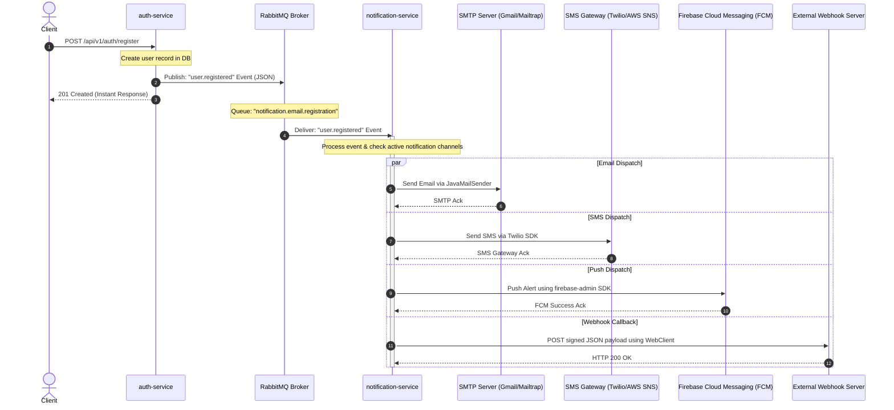

# Architectural Design & Implementation Plan: Asynchronous Notification Service

This plan outlines the design, messaging architecture, and step-by-step implementation for decoupling email and notification tasks from core business services (like `auth-service`) into a dedicated, asynchronous `notification-service` using a message broker.

---

## Section 0: Architectural Rationale & Technical Decisions

### Why Asynchronous Messaging & Decoupling?
In a microservices architecture, executing external operations (like sending emails via SMTP) synchronously during client HTTP requests introduces critical issues:
1. **Latency:** SMTP connections and transmission can take 2–5 seconds, forcing users to wait for page load completion.
2. **Fragility:** If the SMTP server is down or slow, the registration API fails, taking down a critical path.
3. **Coupling:** The `auth-service` should only care about user security and credentials, not template rendering, mail engines, or SMS gateways.

### Selecting the Message Broker: RabbitMQ vs. Kafka
For this project, we recommend **RabbitMQ** (via Spring AMQP / Spring Cloud Stream) for the following reasons:
* **Lightweight:** RabbitMQ is highly optimized for simple, point-to-point and pub-sub messaging, running on very low memory footprints compared to Apache Kafka.
* **Dead Letter Exchanges (DLX):** RabbitMQ natively supports Dead Letter Queues, making it simple to capture and retry failed email deliveries (e.g. SMTP timeout) automatically.
* **Protocols:** Built-in AMQP 0-9-1 is natively supported in Spring Boot via `spring-boot-starter-amqp`.

*Note: If the system needs high-throughput event sourcing or stream analytics in the future, we can seamlessly swap the binder to Apache Kafka utilizing Spring Cloud Stream.*

---

## 1. Decoupled Architecture Diagram (Mermaid)



---

## 2. Multi-Channel Routing Design (Polymorphic Channels)

To handle all communication channels cleanly, the `notification-service` will use a **Polymorphic Notification Strategy Pattern**:

```java
public interface NotificationChannel {
    boolean supports(NotificationType type);
    void send(NotificationPayload payload);
}
```

We will implement four separate channels:
1. `EmailNotificationChannel` (using `JavaMailSender`)
2. `SmsNotificationChannel` (using `Twilio` or `AWS SNS` SDKs)
3. `PushNotificationChannel` (using Firebase `firebase-admin` SDK)
4. `WebhookNotificationChannel` (using non-blocking `WebClient` for HTTP callbacks)

When an event arrives, the `NotificationDispatcher` fetches the user's notification preferences, iterates over the active channels, and dispatches the payload to the matching channels.

### Webhook Signature Security
To prevent tampering and spoofing, the `WebhookNotificationChannel` will sign payloads using HMAC-SHA256 with a client-specific secret key, attaching it as an HTTP header:
```text
X-Hub-Signature-256: sha256=<hex-encoded-signature>
```

---

## 3. Implementation Steps

### A. Message Broker Setup (Docker)
Add RabbitMQ service definitions to the local environment (e.g. `docker-compose.yml`):
```yaml
  rabbitmq:
    image: rabbitmq:4-management
    ports:
      - "5672:5672"   # AMQP protocol port
      - "15672:15672" # Management Web UI port
    environment:
      RABBITMQ_DEFAULT_USER: guest
      RABBITMQ_DEFAULT_PASS: guest
```

### B. Producer Configuration (`auth-service`)
1. **Dependency:** Add `spring-boot-starter-amqp` (or `spring-cloud-stream-binder-rabbit`).
2. **Model:** Declare a shared event class: `UserRegisteredEvent` (containing `userId`, `email`, `fullName`, `timestamp`).
3. **Rabbit Configuration:** Configure standard Exchange (`notification.exchange`, type: Topic) and publishing logic.
4. **Refactor Registration:** Modify registration controller/service to publish the event instead of calling JavaMailSender synchronously.

### C. Consumer Service Creation (`notification-service`)
Initialize a new Maven module `notification-service`:
1. **Dependencies:**
   * `spring-boot-starter-amqp` (RabbitMQ integration)
   * `spring-boot-starter-mail` (JavaMailSender)
   * `spring-cloud-starter-netflix-eureka-client` (Registry enrollment)
   * `com.twilio.sdk:twilio` (SMS Integration)
   * `com.google.firebase:firebase-admin` (Push notification integration)
2. **Rabbit Listener:** Create a listener class checking the queue `notification.email.registration` bound to topic `user.registered`.
3. **Dispatching Logic:** Implement `NotificationDispatcher` to route payloads to active channels (Email, SMS, Push, Webhooks).

---

## 4. Step-by-Step Execution Checklist

* [ ] **Phase 1: Broker & Dependencies**
  * Spin up RabbitMQ container.
  * Add AMQP starter to `auth-service/pom.xml`.
* [ ] **Phase 2: Refactor auth-service (Producer)**
  * Declare AMQP Exchange and Jackson JSON Message Converter.
  * Refactor User signup to publish `UserRegisteredEvent` to the broker.
* [ ] **Phase 3: Bootstrap notification-service (Consumer)**
  * Create the Maven module structure.
  * Implement RabbitMQ listener, JavaMailSender integration, Twilio integration, Firebase Admin integration, and Webhook dispatching.
  * Configure service retry/recovery logic (dead-lettering) for failing webhook HTTP endpoints.
* [ ] **Phase 4: Integration Verification**
  * Register a user via the Gateway, verify instant HTTP response, and check console logs to ensure all channels (Email, SMS, Push, Webhooks) were asynchronously processed.
