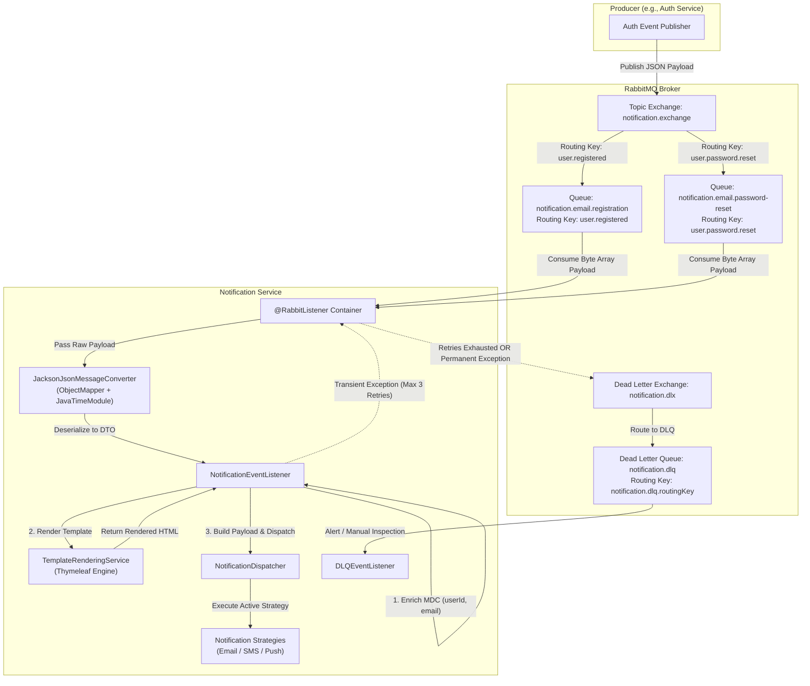

# RabbitMQ Listener & Jackson Deserialization Implementation Plan

This plan details the step-by-step implementation for consuming event messages off RabbitMQ in `notification-service`.

---

## RabbitMQ Fundamentals & Core Concepts Primer

If you are new to RabbitMQ, here is a quick overview of how message queuing works and the key terms used in this microservice architecture:

### 1. What is RabbitMQ?
RabbitMQ is a **message broker** that uses the **AMQP** (Advanced Message Queuing Protocol) standard. It allows microservices to communicate asynchronously without calling each other directly via HTTP/REST APIs. 
- **Decoupling**: `auth-service` doesn't need to know how or when `notification-service` sends emails. It simply publishes an event message and immediately moves on.
- **Reliability**: If `notification-service` is down or busy, messages wait safely inside RabbitMQ queues until the service is ready to process them.

---

### 2. Essential Terminology

| Term | What it Means | Analogy | Example in our App |
| :--- | :--- | :--- | :--- |
| **Producer** | The microservice sending/publishing event messages. | Sender dropping a letter into a post box. | `auth-service` |
| **Consumer** | The microservice listening to a queue and processing messages. | Recipient opening the mail. | `notification-service` |
| **Exchange** | The message router. Producers send messages to an Exchange, NOT directly to queues. | Central Post Office sorting room. | `notification.exchange` |
| **Queue** | A sequential buffer that holds messages until consumers process them. | Personal Mailbox. | `notification.email.registration` |
| **Routing Key** | A string tag attached to a message by the producer (e.g. `user.registered`). | Address on the envelope. | `user.registered` / `user.password.reset` |
| **Binding** | A rule/link that connects an Exchange to a Queue using a Routing Key pattern. | Postman's routing rule ("Route all letters marked 'Zone A' to Box 5"). | Bind `notification.email.registration` to `notification.exchange` with key `user.registered` |
| **Dead Letter Exchange (DLX)** | A fallback Exchange where failed/rejected messages are automatically sent. | Undelivered Mail Department. | `notification.dlx` |
| **Dead Letter Queue (DLQ)** | A queue attached to DLX to hold failed messages for inspection/alerts. | Dead Letter Box. | `notification.dlq` |

---

### 3. Exchange Types in RabbitMQ
RabbitMQ supports 4 exchange routing behaviors:
1. **Topic Exchange (Used in our project - `notification.exchange`)**:
   - Routes messages based on wildcard routing key patterns.
   - Example: `user.registered` routes to registration queue; `user.password.reset` routes to password reset queue; `user.#` matches all user events.
   - Wildcards: `*` matches exactly 1 word (e.g., `user.*`), `#` matches 0 or more words (e.g., `user.#`).
2. **Direct Exchange**: Matches routing keys exactly (`routing_key == binding_key`).
3. **Fanout Exchange**: Broadcasts every message to *all* bound queues (ignores routing keys).
4. **Headers Exchange**: Routes based on HTTP/AMQP message header attributes instead of routing keys.

---

### 4. Message Lifecycle & Acknowledgment (ACK/NACK)
When a consumer receives a message from RabbitMQ:
- **ACK (Acknowledge)**: Consumer notifies RabbitMQ "I processed this message successfully". RabbitMQ deletes the message from the queue.
- **NACK / Reject**: Consumer notifies RabbitMQ "Processing failed".
  - **Requeue = true**: RabbitMQ puts the message back at the front of the queue to try again immediately.
  - **Requeue = false**: RabbitMQ removes the message from the main queue and routes it to the **Dead Letter Exchange (DLX)**.

---

### 5. How Spring Boot (Spring AMQP) Automates This
In Java Spring Boot, you don't need to manually open sockets or manage connection pools:
- **`RabbitMQConfig`**: Uses Java Beans (`TopicExchange`, `Queue`, `Binding`) to automatically declare exchanges, queues, and bindings in RabbitMQ on startup.
- **`JacksonJsonMessageConverter`**: Converts JSON byte arrays sent over RabbitMQ into Java Objects (DTOs) automatically.
- **`@RabbitListener(queues = ...)`**: Annotates a method to act as a background worker thread listener. Spring handles message fetching, JSON deserialization, and automatic ACKs/NACKs based on whether your Java method returns successfully or throws an exception.

---

## End-to-End Data Flow Architecture

Below is the complete data flow architecture illustrating how event messages travel from producers (e.g., `auth-service`) through RabbitMQ exchanges and queues into `notification-service`, including deserialization, template rendering, dispatching, retry logic, and Dead Letter Queue (DLQ) routing.



### Detailed Data Flow Steps

1. **Event Publication (Producer)**:
   - A producer service (e.g., `auth-service`) serializes an event object into JSON and publishes it to `notification.exchange` with a specific routing key (e.g., `user.registered` or `user.password.reset`).

2. **RabbitMQ Topic Exchange Routing**:
   - `notification.exchange` evaluates the routing key against active queue bindings.
   - Messages with routing key `user.registered` are routed to `notification.email.registration`.
   - Messages with routing key `user.password.reset` are routed to `notification.email.password-reset`.

3. **Message Consumption & Deserialization**:
   - The `@RabbitListener` container in `notification-service` pulls the byte array payload from the configured queue.
   - `JacksonJsonMessageConverter` uses `ObjectMapper` (configured with `JavaTimeModule` and `FAIL_ON_UNKNOWN_PROPERTIES=false`) to convert JSON into the targeted Java DTO (e.g., `UserRegisteredEvent` or `PasswordResetRequestedEvent`).

4. **Listener Execution & Processing**:
   - `NotificationEventListener` handles the event:
     - Sets MDC context (e.g., `userId`, `email`) for trace logging.
     - Invokes `TemplateRenderingService` to build dynamic HTML content using Thymeleaf templates.
     - Constructs a `NotificationPayload` domain object.
     - Calls `NotificationDispatcher.dispatch(...)` to select and execute the corresponding notification strategy (e.g., `EmailNotificationStrategy`).
     - Clears MDC context in a `finally` block.

5. **Resilience, Retry & Dead Letter Queue (DLQ)**:
   - **Transient Failures** (e.g., network glitch): Retried up to 3 times with exponential backoff (1s, 2s, 4s).
   - **Permanent Failures** (e.g., `PermanentNotificationException` or exhausted retries): Rejected without requeue (`RejectAndDontRequeueRecoverer`), automatically routed to `notification.dlx` -> `notification.dlq` for debugging/alerting via `DLQEventListener`.

---

## Section 0: Architectural Rationale & Technical Decisions

### 1. Decoupled Event DTO Definition
* **Why:** In microservices architecture, shared DTOs should not force a direct compile-time binary dependency between `auth-service` and `notification-service`. Defining localized `UserRegisteredEvent` and `PasswordResetRequestedEvent` classes in `notification-service` matching the producer's JSON structure ensures clean service boundary separation.

### 2. Jackson JSON Converter Configuration with `JavaTimeModule`
* **Why:** Standard AMQP payloads are transmitted as JSON byte arrays. Spring AMQP uses `MessageConverter` (`JacksonJsonMessageConverter`) to convert JSON into Java objects.
* **Technical Details:** 
  - `ObjectMapper` requires `JavaTimeModule` to handle Java 8 time types (`Instant`, `LocalDateTime`).
  - `DeserializationFeature.FAIL_ON_UNKNOWN_PROPERTIES` is set to `false` so future fields added by producers will not break consumer deserialization.
  - Trusted package type mappings are configured so Jackson safely maps payload headers across different Java packages.

### 3. `@RabbitListener` Asynchronous Processing
* **Why:** The listener processes messages off the durable queue `notification.email.registration` (bound to `notification.exchange` with routing key `user.registered`).
* **DLQ Integration:** Unhandled exceptions during processing will trigger container retries; if retries are exhausted, RabbitMQ automatically routes the message to `notification.dlx` -> `notification.dlq`.

---

## Proposed Changes

### 1. Event DTOs
Create package `com.chauhan.notificationservice.event`:
* `UserRegisteredEvent.java`: `userId` (UUID), `email` (String), `name` (String), `verificationToken` (String), `timestamp` (Instant).
* `PasswordResetRequestedEvent.java`: `userId` (UUID), `email` (String), `name` (String), `resetToken` (String), `timestamp` (Instant).

### 2. Enhanced RabbitMQ Configuration
Update `com.chauhan.notificationservice.config.RabbitMQConfig`:
* Register custom `ObjectMapper` with `JavaTimeModule` and `FAIL_ON_UNKNOWN_PROPERTIES = false`.
* Configure `JacksonJsonMessageConverter` with trusted packages `*`.
* Configure `SimpleRabbitListenerContainerFactory` bean.

### 3. Listener Implementation
Create package `com.chauhan.notificationservice.listener`:
* `NotificationEventListener.java`:
  - Annotated with `@Component` and `@Slf4j`.
  - `@RabbitListener(queues = RabbitMQConfig.REGISTRATION_QUEUE_NAME)`
  - `public void handleUserRegistrationEvent(UserRegisteredEvent event)`

---

## How to Add a New Queue (e.g., Password Reset Notification)

Adding a new notification queue (such as for password reset requests) follows a modular, low-coupling design. Below is a step-by-step guide to implement a new queue end-to-end using the current architecture.

---

### Step 1: Define the Event DTO
Create a localized DTO class in `com.chauhan.notificationservice.event` matching the producer's JSON structure.

```java
package com.chauhan.notificationservice.event;

import lombok.AllArgsConstructor;
import lombok.Builder;
import lombok.Data;
import lombok.NoArgsConstructor;
import java.time.Instant;
import java.util.UUID;

@Data
@Builder
@NoArgsConstructor
@AllArgsConstructor
public class PasswordResetRequestedEvent {
    private UUID userId;
    private String email;
    private String name;
    private String resetToken;
    private Instant timestamp;
}
```

---

### Step 2: Configure Queue and Binding in `RabbitMQConfig`
Update `com.chauhan.notificationservice.config.RabbitMQConfig` by adding constants, the durable queue definition with DLX arguments, and its exchange binding.

```java
// 1. Declare Constants
public static final String PASSWORD_RESET_QUEUE_NAME = "notification.email.password-reset";
public static final String PASSWORD_RESET_ROUTING_KEY = "user.password.reset";

// 2. Declare Queue Bean (with DLX configuration)
@Bean
public Queue passwordResetNotificationQueue() {
    return QueueBuilder.durable(PASSWORD_RESET_QUEUE_NAME)
            .withArgument("x-dead-letter-exchange", DLX_EXCHANGE_NAME)
            .withArgument("x-dead-letter-routing-key", DLQ_ROUTING_KEY)
            .build();
}

// 3. Declare Binding Bean
@Bean
public Binding passwordResetBinding() {
    return BindingBuilder.bind(passwordResetNotificationQueue())
            .to(notificationExchange())
            .with(PASSWORD_RESET_ROUTING_KEY);
}
```

---

### Step 3: Create Thymeleaf HTML Email Template
Add the HTML template file `password-reset.html` in `src/main/resources/templates/email/`:

```html
<!DOCTYPE html>
<html xmlns:th="http://www.thymeleaf.org">
<head><title>Reset Your Password</title></head>
<body>
    <h2>Hello <span th:text="${name}">User</span>,</h2>
    <p>You requested a password reset. Click the link below to set a new password:</p>
    <a th:href="${resetUrl}">Reset Password</a>
    <p>If you did not request this, please ignore this email.</p>
</body>
</html>
```

---

### Step 4: Add Listener Handler Method in `NotificationEventListener`
In `com.chauhan.notificationservice.listener.NotificationEventListener`, add a new `@RabbitListener` method:

```java
@RabbitListener(queues = RabbitMQConfig.PASSWORD_RESET_QUEUE_NAME)
public void handlePasswordResetRequestedEvent(PasswordResetRequestedEvent event) {
    if (event == null || event.getEmail() == null) {
        log.error("Received null or malformed PasswordResetRequestedEvent payload.");
        throw new PermanentNotificationException("Received null or malformed PasswordResetRequestedEvent payload.");
    }

    MDC.put("userId", String.valueOf(event.getUserId()));
    MDC.put("email", event.getEmail());

    log.info("Processing PasswordResetRequestedEvent: userId={}, email={}", event.getUserId(), event.getEmail());

    try {
        String displayName = (event.getName() != null && !event.getName().isBlank()) ? event.getName() : "User";
        String resetUrl = gatewayUrl + "/api/v1/auth/reset-password?token=" + event.getResetToken();

        String htmlContent = templateRenderingService.render("email/password-reset", Map.of(
                "name", displayName,
                "resetUrl", resetUrl
        ));

        NotificationPayload payload = NotificationPayload.builder()
                .recipient(event.getEmail())
                .subject("Reset Your Password - Spring Core Services")
                .body(htmlContent)
                .type(NotificationType.EMAIL)
                .build();

        notificationDispatcher.dispatch(payload);
        log.info("Successfully dispatched password reset notification for: {}", event.getEmail());
    } catch (Exception e) {
        log.error("Failed to process PasswordResetRequestedEvent for: {}", event.getEmail(), e);
        throw e;
    } finally {
        MDC.remove("userId");
        MDC.remove("email");
    }
}
```

---

### Step 5: Producer Side Publishing (e.g., `auth-service`)
Ensure the producer publishes `PasswordResetRequestedEvent` to `notification.exchange` using routing key `user.password.reset`:

```java
rabbitTemplate.convertAndSend(
    "notification.exchange",
    "user.password.reset",
    passwordResetEvent
);
```

---

## Verification Plan

1. Compile check using JDK 25 constraint: `JAVA_HOME=/usr/lib/jvm/java-25-openjdk-amd64 mvn clean compile -f notification-service/pom.xml`.
2. Update `notification-service/markdowns/checklist.md`.

